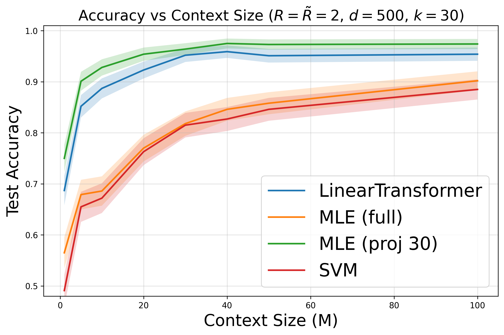
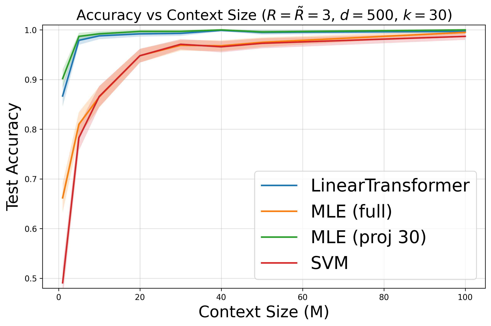
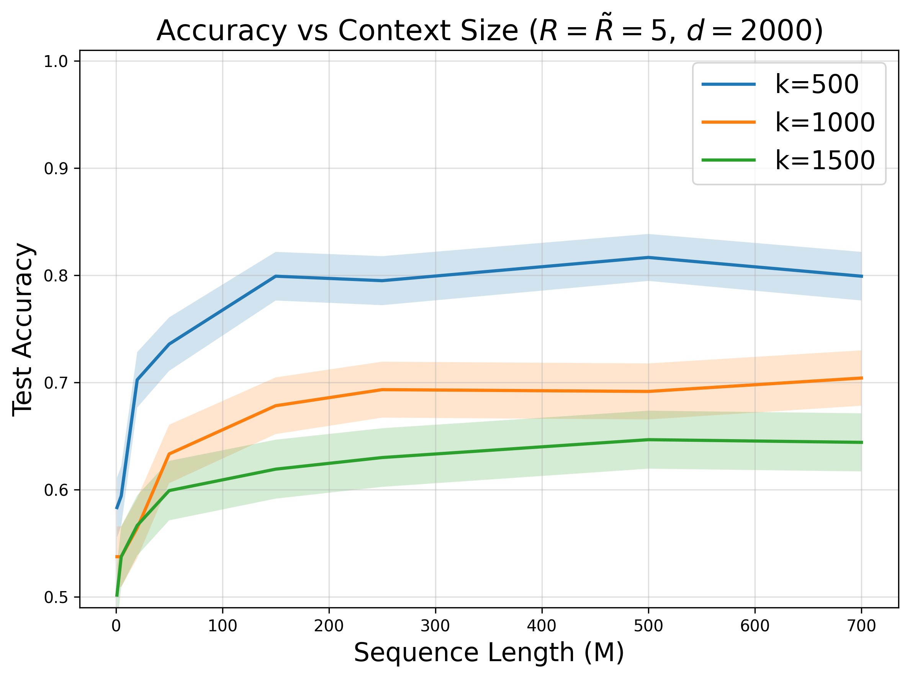
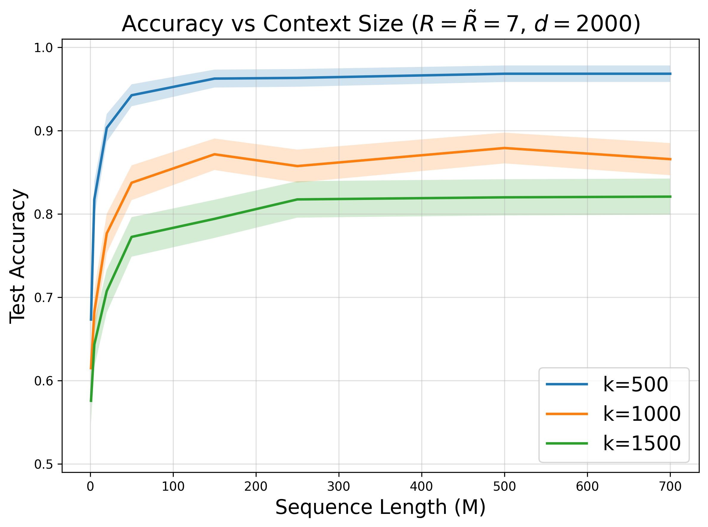
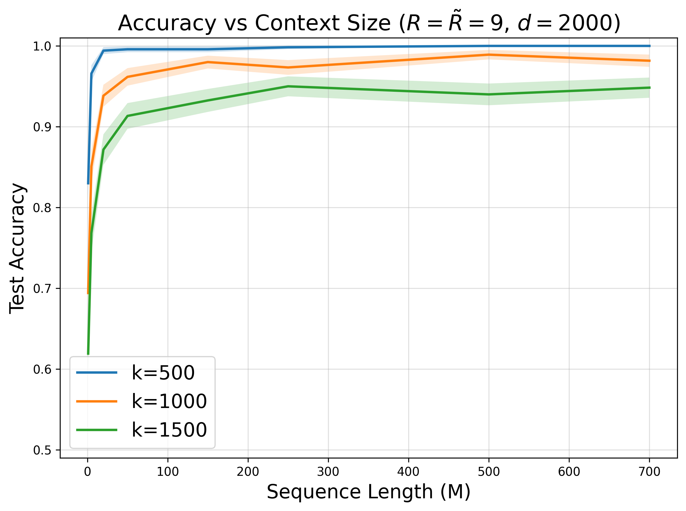

# Transformers are almost optimal metalearners

This repository implements the experiments from "Transformers are almost optimal metalearners for linear classification" (Magen & Vardi, Neurips, 2025). The paper analyzes how linear transformers trained on random linear classification tasks can learn from context and act as almost optimal metalearner, by extract shared representations across diverse but related tasks.

## Results

### Performance vs Number of In-context Examples (M) 

### 1. Across Different Learning Algorithms, Each Plot Represents a Different Signal (R)
<div style="display: flex; justify-content: space-between;">
    
    
</div>

Here we compare the in-context sample complexity of linear attention against three baseline algorithms: (i) Support Vector Machines; (ii) The maximum likelihood estimator (MLE); (iii) MLE with access to the ground-true subspace, which first projects the data, and only then applies MLE. We see that the linear transformer outperforms both SVM and MLE, which lack access to the subspace, and nearly match the performance of the MLE with projection.


### 2. Across Different Subspasce Dimenssions (k), Each Plot Represents a Different Signal (R)
<div style="display: flex; justify-content: space-between;">
    
    
    
</div>

we examine the effect of the shared subspace dimension k, with each plot corresponding to a different signal strength. Accuracy improves as the signal strength R increases and as the subspace dimension k decreases.

## Setup

Create and activate conda environment:
```bash
conda create -n icl_classification python=3.11
conda activate icl_classification
```

Install requirements:
```bash
python -m pip install -r requirements.txt
```

## Running the Code

1. First, run the test suite to verify implementation:
```bash
python -m pytest test.py -v
```

All tests should pass (you may get a few warnings about package deprecations).

2. Train models across different dimensions and batch sizes:
```bash
python classification_icl_subspace.py
```
This will save model checkpoints to the `checkpoints/` directory.

3. Generate evaluation plots:
```bash
python eval_and_plot.py
```
This will create the performance curves shown above in the `plots/` directory.

## Implementation Details

The codebase consists of three main components:

- `classification_icl_subspace.py`: Main implementation including:
  - `GaussianMixtureDataset`: Generates synthetic classification data
  - `LinearTransformer`: Single-layer linear transformer model
  - `Trainer`: Handles training loop and metrics tracking

- `test.py`: Comprehensive test suite covering:
  - Dataset generation and properties
  - Model architecture
  - Training dynamics
  - Memorization behavior

- `eval_and_plot.py`: Evaluation utilities including:
  - Loading and analyzing model checkpoints
  - Computing performance metrics
  - Generating plots

Key features:
- Full-batch gradient descent training
- Simple linear layer $W \in R^{d\times d}$ architecture
- Gaussian mixture data generation with configurable signal-to-noise ratio R
- Label noise support via flipping probability p
- Tracking of in-context memorization and generalization metrics

## Citation

If you use find this helpful:
```
@article{magen2025transformers,
  title={Transformers are almost optimal metalearners for linear classification},
  author={Magen, Roey and Vardi, Gal},
  journal={arXiv preprint arXiv:2510.19797},
  year={2025}
}
```

## Acknowledgments

This code is partially based on the implementation from Frei and Vardi (2024): 
*Trained transformer classifiers generalize and exhibit benign overfitting in-context*.
